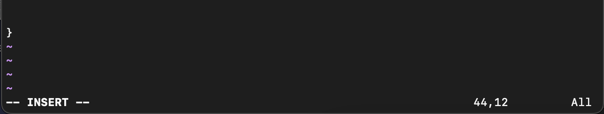

# Lab Report 5: VIM Command Line Task 
This lab report will provide a chronological step-by-step procedure on how to fork and clone a repository and utilize VIM to help edit/modify/save the file. 

**Objectives:**
- [ ] Clone your fork of the repository from your Github account  
- [ ] Open and edit the file directly in the terminal  
- [ ] Debug the code to have tests run successfully 
- [ ] Commit and push the resulting change to your GitHub account 

## Step 1: SetUp: Delete Existing Repository 
You may or may not have already forked this file so let's start over for this assignment by deleting. 
1. Log into your GitHub account and on the top right corner, click on your profile and click on `your repositories`   
2. Click onto the repository that you are trying to work with and go to its 'settings` on the far right at the top   
3. Scroll onto the bottom and choose the option to `delete this repository`.    
4. Open your terminal on the computer and log into your @ieng6 account.   
5. In the terminal, remove the directory from your account by using the command `rm -r lab7/`. You can log out afterwards once you finished this step.    

## Step 2: Fork the Repository 
Click on the [link](https://github.com/ucsd-cse15l-s23/lab7) to fork Lab 7's repository by going to the top right corner.   

## Step 3: Begin The Timer
Set a timer before you start doing the tasks of logging into your specific account, cloning the repository, and editing the file. 

## Step 4: Log Into Your Account Using ieng6
In the terminal, login into your account using `$ ssh cs15lsp23zz@ieng6.ucsd.edu`. This step is similar part 5 of step 4. Refer to the picture from that step if needed to clarify the result display. My login did not prompt for password input as I already had set up the SSH Key to my account. 

## Step 5: Clone Your Repository That You Forked 
1. In the terminal, git clone the repository that you have done in your GitHub account into the ieng6 account. You can simply go to the forked repository in GitHub on a new tab and copy the link from the browser to complete the following command in your terminal. `$ git clone <the link>`    
2. After you have cloned into the account, use `ls` to make sure it is successfully cloned. Lab7 should be displayed.    
3. Change your directory to go into lab7's file using `cd lab7/`
4. After you change the directory, you can see the files inside lab7 and check what are the names of the files to pull up to edit later. Use ls to see the contents and your terminal should be similar to the picture shown below.   

## Step 6: Run the Tests to Demonstrate That They Fail
Run the test using the command `bash test.sh`
The result in the terminal should be similar to the picture shown below, indicating there are test(s) that have failed.     
Explanation: The command will run the tests using JUnit for the ListExamples.java file. Run indicates how many the tests passed and failures indicates the amount of tests have failed. Read the description of the output to see possible errors. 

## Step 7: Fix the Code So Test Can Run 
1. In the terminal, use the command <>???? and press `enter` so the contents of the file will be opened. Your terminal should display like similar to the picture below.    
2. Follow the instructions to modify the code. 
### First Step: Move Your Cursor Until It Reaches the Correct Line 
We need to modify the code where it is commented to "change index1 below to index2 to fix test".     
You can either 
* Option 1: Press key `J` (helps you move the cursor downwards) until you reach the code line OR 
* Option 2: Use the command `/<toFind>` where toFind is the specific keyword you are looking for to see if it exists in the code. In this case, you can use `/index1`

### Second Step: Move the Cursor Until It is on number "1" 
Once you have reached the right line of code to edit, use the key `L` on your keyboard to move your cursor to the right until it is exactly on 1 of the variable index1.  
  

### Third Step: Change "1" to Become "2"
* Part 1: Type `i` so that you can be changed into Insertion Mode within the file and make modifications 
* Part 2: Press `<enter>` 
* Part 2: Use `<backspace>` go towards the letter/character that needs to be changed 
* Part 3: Press `<delete>` to remove "1" from variable "index1" 
* Part 4: Press the number `2` on your keyboard to make it become "index2" 
* Part 5: Press `<escape>` to exit from Insertion Mode 

After this step, you should have changed part of your code. 
Before:      
After:    

***Note: DO NOT do anything after this step and follow onto the next step.***
### Step 8: Run the Tests to Demonstrate That They Pass
1. After you have finished editing, make sure to save the modified file. Use the command `:wq` and press `<enter>` to save the edited file. 
2. Then press `<return>` and press `<enter>` to exit the file to bring the user back to the terminal command's line. 
3. Once you reach this step, you have already fixed the error. Let's run the tests now to see if they all will pass or fail. Just like how you ran the tests previously from step 6, type the command `bash test.sh` once more in the terminal. Your terminal should display the result similar to the picture being shown below.   

### Step 9: Commit and Push Your Edited Contents to GitHub 
1. Add the modified file/content into the repository. In the terminal, type in the command `git add ListExamples.java` and press `<enter>`
2. Then, commit the modified file with a newly updated message. In the terminal, type in the command `git commit -m "<yourChosenMessage"`. Within the quotation marks, you have the choice of writing any commit message of your choice as it is your own work so put something to let yourself know the file has been changed. An example in the correct format with the message "index1 was updated" is: `git commit -m "index1 was updated"`. Press `<enter>` after to see the following result similar to your terminal's display.   
3. Lastly, we want to push our modified contents into the forked repository. In the terminal, type in `git push origin` and press `<enter>`. You should see a similar result in your terminal like the picture shown below.   

### Conclusion: 
Great job following the instructions! We were able to: 
- [x] Clone your fork of the repository from your Github account  
- [x] Open and edit the file directly in the terminal  
- [x] Debug the code to have tests run successfully 
- [x] Commit and push the resulting change to your GitHub account 
Now you can try editing other programming assignments that you have forked from GitHub wth these steps that you have learned! 
